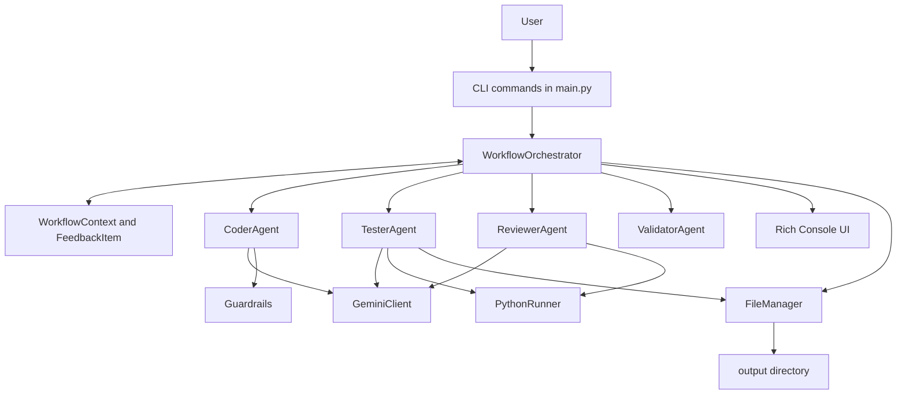
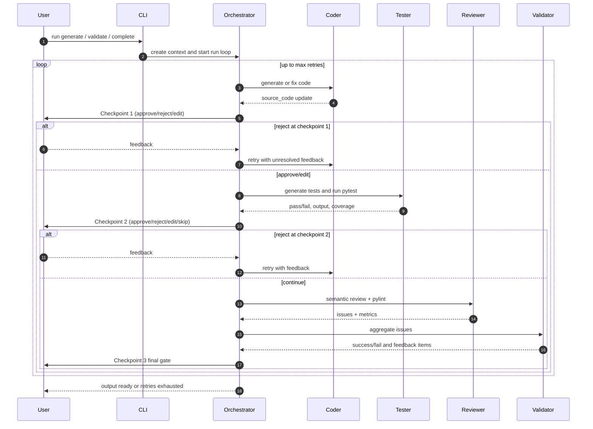
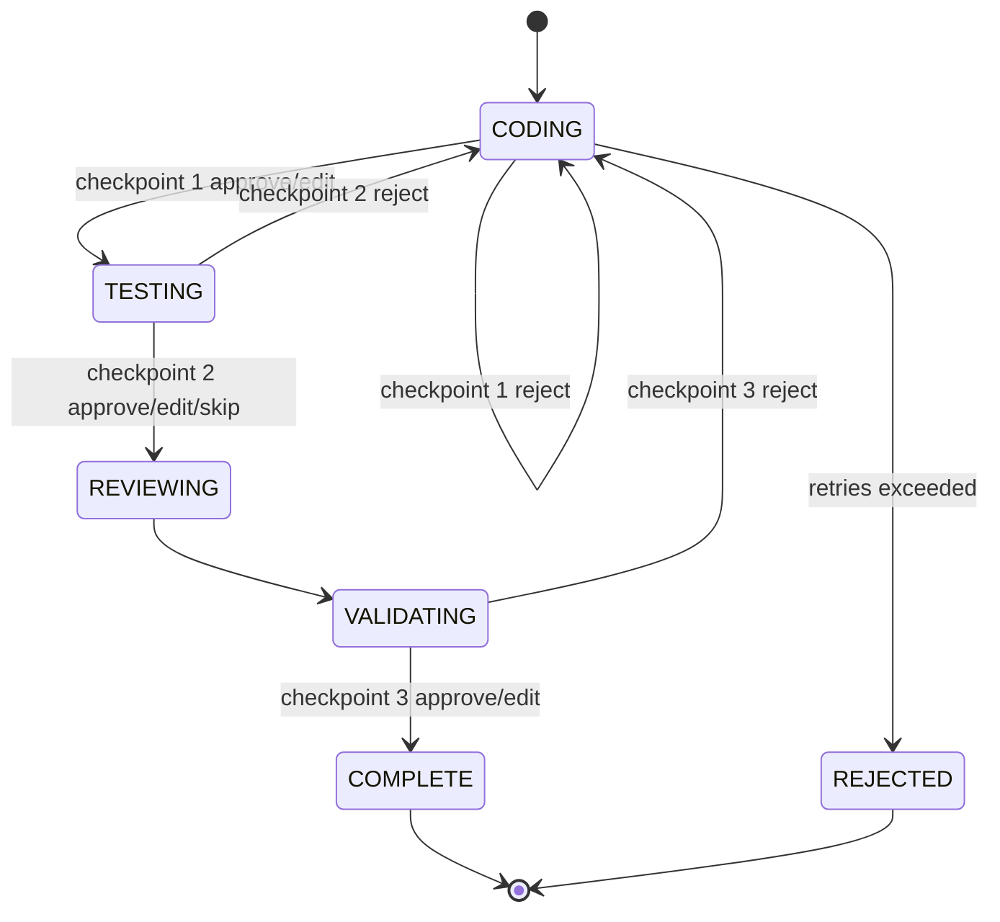

# AI-Driven Development Automation: Complete Project Guide

## 1. What This Project Is

This project is a Human-in-the-Loop (HITL) AI software pipeline for Python development.

In simple words:

- You give a coding instruction.
- AI generates or improves code.
- AI generates tests and runs them.
- AI reviews quality and style.
- You approve, reject, or manually edit at checkpoints.
- The system loops until quality is acceptable or retry limit is reached.

This is called orchestration because one central workflow coordinates multiple specialized agents in a fixed order.

## 2. What You Have Built

You built a multi-agent coding system with:

- CLI interface with 3 modes: generate, validate, complete.
- Central workflow engine with checkpoints and retries.
- Structured feedback model shared across agents.
- LLM integration through Gemini via OpenAI-compatible endpoint.
- Test generation and execution with pytest and coverage.
- Review layer using LLM semantics plus pylint static analysis.
- Validator layer that aggregates failures and decides pass/fail readiness.
- Guardrails to prevent unintended broad code changes.
- Rich terminal UI for code display, diffing, metrics, and human decisions.

## 3. High-Level Architecture

## 4. End-to-End Runtime Sequence

## 5. State Machine (Pipeline Stages)

## 6. Project Structure and Responsibilities

## Root files

- README.md: architecture + conceptual overview.
- USER_GUIDE.md: user operations and checkpoint behavior.
- sample.txt: example command usage.
- bad_code.py: minimal input for validate mode demo.
- skeleton.py: incomplete input for complete mode demo.
- test_gemini_connection.py: direct LLM connectivity test.
- requirements.txt: runtime plus dev dependencies (currently fully frozen list).
- pyproject.toml: package metadata and src-layout settings.

## Source package under src/orchestrator

- main.py: Typer CLI entry points and mode dispatch.
- config.py: loads env vars and validates GEMINI_API_KEY.
- core/context.py: context dataclasses, history, feedback, retries, metrics.
- core/workflow.py: full orchestration loop and checkpoints.
- core/guardrails.py: scope validation + preservation checks.
- llm/gemini_client.py: LLM wrapper with sanitization and retry handling.
- tools/file_manager.py: read/write helper abstraction.
- tools/python_runner.py: pytest execution and coverage parsing.
- agents/base.py: abstract base agent contract.
- agents/coder.py: generation, validation, hybrid completion, and targeted fixes.
- agents/tester.py: test generation and execution.
- agents/reviewer.py: semantic review and pylint parsing.
- agents/validator.py: gate logic from test and review outcomes.
- cli/console.py: rich rendering, diffs, metrics table, and prompts.

## Tests under tests

- test_coder_agent.py: manual-style coder isolation script.
- test_pipeline.py: full pipeline smoke test with generated artifacts check.
- test_system.py: broader system checks; one assertion is stale vs current coder error message text.

## Output directory

- output/: generated source and tests from recent runs.
- During a run, orchestrator clears and recreates output directory.

## 7. CLI Modes and Behavior

## Mode 1: generate

Command pattern:

- python -m orchestrator.main generate "your requirements"

Behavior:

- Builds prompt from free-text requirements.
- Coder generates new file(s).
- Full pipeline executes with checkpoints.

## Mode 2: validate

Command pattern:

- python -m orchestrator.main validate path_to_file.py

Behavior:

- Reads existing file content.
- Sends through pipeline to improve quality.

## Mode 3: complete (hybrid)

Command pattern:

- python -m orchestrator.main complete skeleton.py "requirements"

Behavior:

- Reads skeleton/incomplete code.
- Coder fills missing logic according to requirements.

## 8. Human-in-the-Loop Checkpoints

## Checkpoint 1: code review

- Shows generated code or diff from previous iteration.
- Optional guardrail warnings are shown.
- Actions: approve, reject, edit.

## Checkpoint 2: test review

- Shows tests pass/fail status and coverage.
- Shows pytest output.
- Actions: approve, reject, edit tests, skip.

## Checkpoint 3: final review

- Shows metrics, review report, unresolved feedback table.
- Actions: approve, reject, edit.

Human decisions are recorded in context.human_actions with stage, action, feedback text, timestamp, and attempt number.

## 9. Feedback and Retry Model

The system uses structured FeedbackItem objects:

- source: human, reviewer, tester, validator.
- severity: critical, major, minor, suggestion.
- description: what is wrong.
- location: optional code location hint.
- action: fix, keep, rewrite.
- resolved: whether handled in later iteration.

Retry policy:

- max_retries = 3 in context.
- Total attempts up to 4 (initial + 3 retries).
- Rejections or validator failure push unresolved items back into coder fix loop.

## 10. Guardrails

Guardrails protect against noisy or dangerous fixes.

## Scope validation

- Compares old vs new changed lines.
- Checks whether changed regions are linked to feedback locations.
- Warns when out-of-scope lines are modified.

## Preservation validation

- AST-based check for accidental deletion of:
  - functions
  - classes
  - function docstrings
- Produces warnings when removed.

Warnings are informational for human review; they do not hard-block execution.

## 11. LLM Integration Design

GeminiClient behavior:

- Uses OpenAI client with Gemini base URL.
- Reads model and key from config.
- Applies text sanitization to remove control tokens.
- Handles rate-limit retries with wait.
- Raises LLMError for API failures.

Prompt strategy by agent:

- Coder: strict generation and targeted fix prompts with preservation rules.
- Tester: asks for pytest tests, import correctness, and executable assertions.
- Reviewer: asks for structured severity/location/problem outputs.

## 12. Testing and Quality Pipeline

## TesterAgent

- Generates test file(s) as test\_<source>.py.
- Executes pytest in output directory through PythonRunner.
- Stores:
  - passed boolean
  - test output text
  - coverage percentage

## PythonRunner

- Executes pytest with flags:
  - -v
  - --tb=short
  - --cov=<directory>
  - --cov-report=term-missing
- Parses TOTAL line for coverage percentage.
- Returns fallback coverage 100 only when tests passed and TOTAL not parseable.

## ReviewerAgent

- Semantic LLM review report.
- Runs pylint and parses diagnostics into FeedbackItems.
- Updates metrics:
  - pylint_score
  - security_issues count
  - lines of code

## ValidatorAgent

- Converts test failures into critical feedback.
- Adds or refreshes validator/tester-origin feedback.
- Sets context.success false when unresolved critical/major issues exist.

## 13. Metrics Collected

The workflow records:

- coder_time
- tester_time
- reviewer_time
- validator_time
- total_time
- attempts
- coverage
- pylint_score
- security_issues
- loc

Metrics are rendered in a Rich table during final review.

## 14. UI and Developer Experience

Rich console features:

- colorized syntax display
- unified diffs across iterations
- feedback table with severity coloring
- guardrail warning panel
- interactive approval/rejection/edit prompts
- multiline paste support (END terminator)

This design enables transparency and human control while still using automation.

## 15. Your Working Examples in This Repository

Sample commands in sample.txt:

- python -m orchestrator.main generate "Create a function that calculates the area of a circle."
- python -m orchestrator.main validate bad_code.py
- python -m orchestrator.main complete skeleton.py "Multiply two numbers"

Input examples:

- bad_code.py contains a minimal add function.
- skeleton.py contains multiply with pass.

Recent generated output example:

- output/todo_app.py and output/test_todo_app.py demonstrate full generate + test pipeline.

## 16. Important Issue You Hit and Why

Issue seen:

- pytest failed with unrecognized arguments --cov and --cov-report.

Root cause:

- coverage flags require pytest-cov plugin.

What was done:

- pytest-cov was added to dependencies.
- requirements file was later frozen with pip freeze and now includes pytest-cov.

This is a key operational lesson: tool flags and installed plugins must stay aligned.

## 17. Current Known Gaps and Risks

1. test_system.py contains an assertion expecting error text "not yet supported", but coder currently emits "Unknown mode" text.
2. Some tests import using src.orchestrator while others import orchestrator; environment setup can affect discovery consistency.
3. test files in tests folder can invoke interactive workflow paths, which may require mocking for fully automated CI.
4. output directory is deleted and recreated each run; do not store manual work there unless you plan to copy it elsewhere.

## 18. How to Run the Project Safely

1. Create and activate virtual environment.
2. Install package and dependencies.
3. Set GEMINI_API_KEY in environment or .env.
4. Run one of the CLI modes.
5. At checkpoints, choose:
   - approve when good
   - reject with precise feedback when wrong
   - edit when you want direct control
6. Collect final artifacts from output directory.

## 19. Suggested CI Direction

If you productionize this project further:

- Add non-interactive mode for CI pipelines.
- Add deterministic unit tests with mocked Gemini responses.
- Add linting and formatting checks in pre-commit.
- Add schema validation for LLM response structures.
- Add stronger artifact versioning instead of wiping output each run.

## 20. Glossary

- Orchestration: coordinating multiple agents and steps under one workflow.
- HITL: Human-in-the-Loop; human checkpoint control is required.
- Agent: specialized component with one responsibility.
- FeedbackItem: structured issue record passed between steps.
- Guardrail: safety check that warns about out-of-scope or destructive changes.
- Coverage: percentage of code exercised by tests.

## 21. Quick Mental Model for Beginners

Think of this project as a software factory line:

- Coder writes.
- Tester checks behavior.
- Reviewer checks quality.
- Validator decides readiness.
- You are the final quality manager at three checkpoints.
- WorkflowOrchestrator is the factory supervisor coordinating everything.

That is the full system you have built and worked on in this repository.
