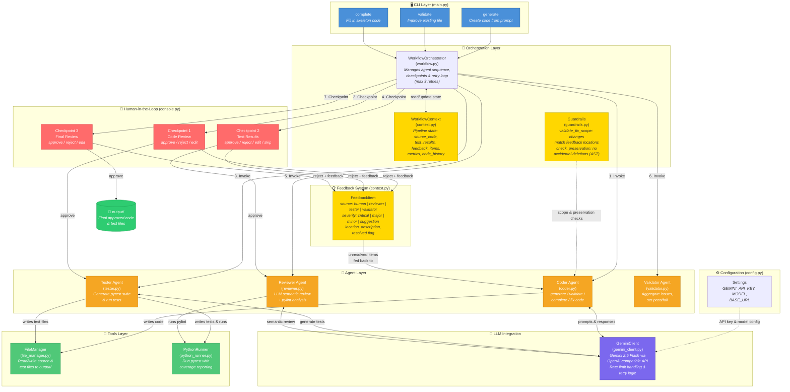
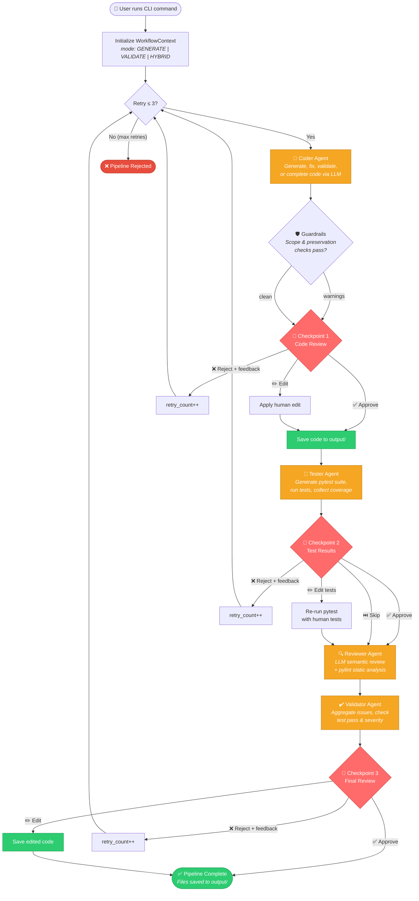

# ai-driven-development-automation

An AI-powered, Human-in-the-Loop (HITL) pipeline that uses specialized agents to generate, test, review, and validate Python code — with you in control at every step.

---

## Architecture Diagram

---

## Pipeline Flow

---

## Component Details

| Layer             | Component            | File               | Responsibility                                                                                  |
| ----------------- | -------------------- | ------------------ | ----------------------------------------------------------------------------------------------- |
| **CLI**           | Typer Commands       | `main.py`          | Entry point — `generate`, `validate`, `complete` commands                                       |
| **Config**        | Settings             | `config.py`        | Manages `GEMINI_API_KEY`, model name, and base URL                                              |
| **Orchestration** | WorkflowOrchestrator | `workflow.py`      | Runs the agent sequence, manages checkpoints and retry loop                                     |
| **Orchestration** | WorkflowContext      | `context.py`       | Carries pipeline state: source code, test results, metrics, feedback, code history              |
| **Orchestration** | Guardrails           | `guardrails.py`    | Validates fix scope (changes match feedback) and preservation (no accidental deletions via AST) |
| **Agents**        | CoderAgent           | `coder.py`         | Generates, fixes, validates, or completes code via LLM prompts                                  |
| **Agents**        | TesterAgent          | `tester.py`        | Generates pytest test suites via LLM, runs them, collects coverage                              |
| **Agents**        | ReviewerAgent        | `reviewer.py`      | Performs LLM semantic review + pylint static analysis, emits FeedbackItems                      |
| **Agents**        | ValidatorAgent       | `validator.py`     | Aggregates issues from all sources, sets pipeline pass/fail                                     |
| **LLM**           | GeminiClient         | `gemini_client.py` | Gemini 2.5 Flash via OpenAI-compatible API with rate-limit handling and retries                 |
| **Tools**         | FileManager          | `file_manager.py`  | Reads and writes source/test files to the `output/` directory                                   |
| **Tools**         | PythonRunner         | `python_runner.py` | Runs `pytest --cov` and parses coverage percentage                                              |
| **UI**            | Console              | `console.py`       | Rich-based TUI: syntax highlighting, diffs, feedback tables, metrics, human prompts             |
| **Data**          | FeedbackItem         | `context.py`       | Structured issue record: source, severity, location, description, resolved flag                 |
